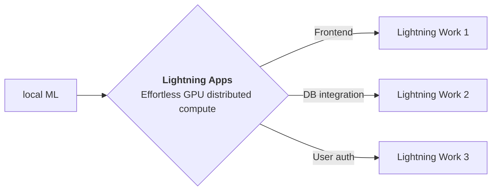

<div style="height: 90pt;"></div>
<div style="flex: 0 0 16%; margin-top: -10pt;">

</div>
<div style="flex: 0 0 65%; text-align: center;">
<h1 style="margin-bottom: 10pt;">Poster: Hate Speech Detection</h1>
<h2>Poster on Hate Speech Detection made with Lightning App</h2>
</div>
<div style="flex: 1">
    <div style="display: flex; align-items: center;">
        
        <div style="font-size: 0.9rem; margin-right: 5pt;"><a href="https://github.com/lightning-AI/">Lightning-AI</a></div>
    </div>
    <div style="display: flex; align-items: center;">
        
        <div style="font-size: 0.9rem;"><a href="https://twitter.com/PyTorchLightnin">@PytorchLightnin</a></div>
    </div>
</div>

--split--

# Hate Speech Detection

As any social media user might have experienced by now, it's becoming effortless to get likes, comments, and shares on
posts with divisive content due to the recommendation algorithms used in these applications. Increasingly, online hate
speech is leading to real-world harm, and these companies are struggling to identify hateful posts, with users & groups
altering their speech patterns online to avoid detection.

We propose building any applications with natural language user input in an Inclusive First approach with an easy-to-use
multilingual hate speech detector running in a production-ready and enterprise-grade environment. Our approach makes it
easier develop and deploy inclusive applications, without any cloud prerequisites, as a quick way to build any
distributed ML system. In this app, we will show you how to use this hate speech detector component within an
application & deploy it to Lightning.ai

> Model to Sai Saketh Aluru, Binny Mathew, Punyajoy Saha and Animesh Mukherjee for their
> work [DE-LIMIT](https://github.com/hate-alert/DE-LIMIT)

--split--

# Lightning Apps

## Lightning Apps can be built for any AI use case, including AI research, fault-tolerant production-ready pipelines, and everything in between.

!!! abstract "Key Features"

```
- **Easy to use-** Lightning apps follow the Lightning philosophy- easy to read, modular, intuitive, pythonic and highly composable interface that allows you to focus on what's important for you, and automate the rest.
- **Easy to scale**- Lightning provides a common experience locally and in the cloud. The Lightning.ai cloud platform abstracts the infrastructure, so you can run your apps at any scale. The modular and composable framework allows for simpler testing and debugging.
- **Leverage the power of the community-** Lightning.ai offers a variety of apps for any use case you can use as is or build upon. By following the best MLOps practices provided through the apps and documentation you can deploy state-of-the-art ML applications in days, not months.
```


